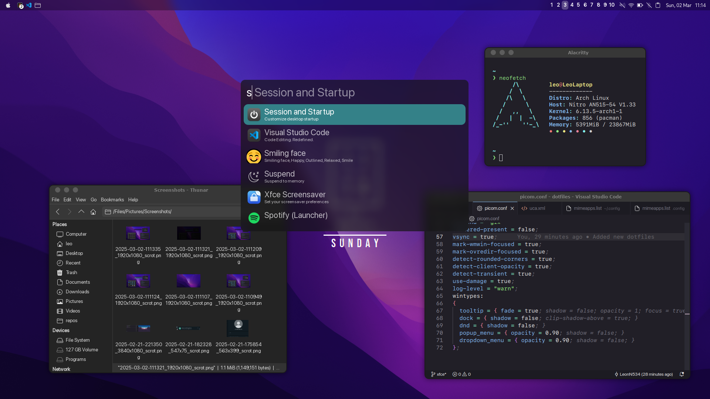

# LeonN's dotfiles



# Installation

The installation begins right after a clean [installation of Arch Linux](https://wiki.archlinux.org/title/installation_guide), concretely, after setting the root password. Here I like to follow some steps of [Antonio Sarosi's dotfiles](https://github.com/antoniosarosi/dotfiles).

# Arch Installation

First, while still in the chroot environment, you have to make sure to have working internet:

```bash
pacman -S networkmanager
systemctl enable NetworkManager
```

Now you can install a bootloader and test it "safely", this is how to do it on
modern hardware,
[assuming you've mounted the efi partition on /boot](https://wiki.archlinux.org/index.php/Installation_guide#Example_layouts):

```bash
pacman -S grub efibootmgr os-prober
grub-install --target=x86_64-efi --efi-directory=/boot
os-prober
grub-mkconfig -o /boot/grub/grub.cfg
```

Now you can create your user:

```bash
useradd -m username
passwd username
usermod -aG wheel,video,audio,storage username
```

In order to have root privileges we need sudo:

```bash
pacman -S sudo
```

Edit **/etc/sudoers** with nano or vim by uncommenting this line:

```bash
## Uncomment to allow members of group wheel to execute any command
# %wheel ALL=(ALL) ALL
```

Now you can reboot:

```bash
# Exit out of ISO image, unmount it and remove it
exit
umount -R /mnt
reboot
```

After logging in, your internet should be working just fine, but that's only if
your computer is plugged in. If you're on a laptop with no Ethernet ports, you
might have used **[iwctl](https://wiki.archlinux.org/index.php/Iwd#iwctl)**
during installation, but that program is not available anymore unless you have
installed it explicitly. However, we've installed
**[NetworkManager](https://wiki.archlinux.org/index.php/NetworkManager)**,
so no problem, this is how you connect to a wireless LAN with this software:

```bash
# List all available networks
nmcli device wifi list
# Connect to your network
nmcli device wifi connect YOUR_SSID password YOUR_PASSWORD
```

Check [this page](https://wiki.archlinux.org/index.php/NetworkManager#nmcli_examples)
for other options provided by _nmcli_. The last thing we need to do before
thinking about desktop environments is installing **[Xorg](https://wiki.archlinux.org/index.php/Xorg)**:

```bash
sudo pacman -S xorg
```

# Dotfiles installation

## **Install-script**

If you are in a clean Arch environment, you can use the install-script file included in this repo. This will install all the packages, its dependencies and the configuration files. If you do not want to use this script, you can get to the [next section](#manual-installation), which is a guide for a manual installation.

The first thing you have to do is install git and clone this repository:

```bash
sudo pacman -S git base-devel
git clone https://github.com/LeonN534/My-Dotfiles.git
```

Now, get inside the "My-Dotfiles" folder and execute the install-script.sh:

```bash
cd My-Dotfiles
./install-script.sh
```

After running the script, you will be asked to type your password sometimes. This is needed to copy some files, install some packages and change some stuff. Once the execution has finished, you'll have to restart your systems and you'll be done.

## **Manual installation**

### **Login and window manager**

As we already installed Xorg, we will install a session manager: **[lightdm](https://wiki.archlinux.org/index.php/LightDM)**. Lightdm will not
work unless we install a **[greeter](https://wiki.archlinux.org/index.php/LightDM#Greeter)**. I use **[openbox](https://wiki.archlinux.org/title/openbox)** as window manager. Openbox has a menu for some applications when you right-click on the desktop, unfortunately, the terminal we will install is not present in that list. That's why we will have to install **[xterm](https://wiki.archlinux.org/title/Xterm)**, which is one of the terminals Openbox allows out of the box.

```bash
sudo pacman -S lightdm lightdm-gtk-greeter lightdm-webkit2-greeter openbox
```

Enable _lightdm_ service and restart your computer, you should be able to log into
Openbox through _lightdm_.

```bash
sudo systemctl enable lightdm
reboot
```

### **Terminal**

Once you have rebooted your system, you will be in the basic openbox desktop. Right-click on any part of that black screen and you will see a menu, search for _Terminals_ and then _Xterm_. We will use this terminal to install another terminal: **[alacritty](https://wiki.archlinux.org/title/Alacritty)**.

```bash
sudo pacman -S alacritty
```

After installing Alacritty, type in the Xterm terminal "alacritty" (without the quotation marks) and another terminal will appear. From now on, we will use this method to open Alacritty and we will continue this guide assuming all the commands you type are being typed in Alacritty.

You might be wondering, why not use the Xterm terminal for the rest of the tutorial? Well, the last time I used Xterm I wasn't able to paste stuff in it without installing plugins. This is not the case with Alacritty, which has all these functionalities out of the box. If for some reason this changed and Xterm allows that stuff by default, feel free to use it or use any terminal to continue this guide.

### **Web browser**

To be able to continue this guide just copying and pasting the commands instead of typing them individually, you will need a web browser, which in this case is **[Firefox](https://wiki.archlinux.org/title/firefox)**.

```bash
sudo pacman -S firefox
```

### **Text and code editor**

To edit small files in Windows, I used to use the notepad provided by Windows because it was a lightweight **text** editor for quick editions. Now, in Arch, I work under the same philosophy: for quick and small text edition I use Vim. Now, since these dotfiles don't have config files for **[Vim](https://wiki.archlinux.org/title/Vim)**, you can replace it with something like **[Nano](https://wiki.archlinux.org/title/Nano)**.

```bash
sudo pacman -S vim
#or
sudo pacman -S nano
```

Now, for code edition I use something more appropiate: **[Visual Studio Code](https://wiki.archlinux.org/title/Visual_Studio_Code)**.

```bash
sudo pacman -S code
```

### **File manager**

I use **[Thunar](https://wiki.archlinux.org/title/thunar)** as file manager. You also need the other packages below in other to be able to add some funcionalities for the file manager. you can read more about them in the Thunar link.

```bash
sudo pacman -S thunar thunar-archive-plugin ffmpegthumbnailer tumbler
```

### **Task bar**

As a task bar I use a light and customizable panel whicih comes with an integrated system tray: **[Tint2](https://wiki.archlinux.org/title/tint2)**.

```bash
sudo pacman -S tint2
```

### **System audio**

Until now, you won't be able to listen to anything. In order to get sound from our system, we need to install an audio server, like **[Pulse audio](https://wiki.archlinux.org/title/PulseAudio)**, and a graphical program to control it, **[Pavucontrol](https://archlinux.org/packages/extra/x86_64/pavucontrol/)**.

```bash
sudo pacman -S pulseaudio pavucontrol pulseaudio-alsa alsa-utils
```

### **Screen brightness**

If you're on a laptop, you probably want to control the brightness of the screen. In order to achieve that, we must install a package that allow us to do that, like **[brightnessctl](https://archlinux.org/packages/extra/x86_64/brightnessctl/)**

```bash
sudo pacman -S brightnessctl
```

### **Storage**

We also need an utility to automount external devices, like USB flash drives, whenever we connect them. In order to achieve this, we need to install **[udiskie](https://github.com/coldfix/udiskie/wiki/Usage)** and also **[ntfs-3g](https://wiki.archlinux.org/title/NTFS-3G)** to read and write NTFS formatted drives:

```bash
sudo pacman -S udiskie ntfs-3g
```

### **Network**

We already configured the network through nmcli, but a graphical frontend is more friendly. I use **[nm-applet](https://wiki.archlinux.org/title/NetworkManager#nm-applet)**:

### **Notifications**

In order to display notifications about the system volume, screen brightness, actions made by the user, etc. we need **[Dunst](https://wiki.archlinux.org/title/Dunst)**.

```bash
sudo pacman -S dunst
```

### **Power management**

In order to turn the screen off, suspend the system after a certain amount of time or, if you are on a laptop, suspend the system after closing the lid, we need a package that allows us to control these events and set a response for them. We are going to use **[xfce-power-manager](https://archlinux.org/packages/?name=xfce4-power-manager)**:

```bash
sudo pacman -S xfce-power-manager
```

### **Screen locker**

To be able to lock our screen when a certain amount of time passes, or after suspending the system, we will use **[light-locker](https://wiki.archlinux.org/title/LightDM#Lock_the_screen_using_light-locker)**:

```bash
sudo pacman -S light-locker
```

### **Clipboard**

To be able to use a copy stuff to the clipboard via CLI, we will use **[xclip](https://archlinux.org/packages/extra/x86_64/xclip/)**, and as a clipboard manager, which let us access to a clipboard history, we'll be using **[parcellite](https://archlinux.org/packages/extra/x86_64/parcellite/)**:

```bash
sudo pacman -S xclip parcellite
```

### **Multimedia**

To open images and visualize them, I like to use **[viewnior](https://archlinux.org/packages/extra/x86_64/viewnior/)**. And to reproduceboth audio and video, I like to use **[vlc](https://wiki.archlinux.org/title/VLC_media_player)**:

```bash
sudo pacman -S viewnior vlc
```

### **Screenshoot**

For capturing an image of the screen I use **[scrot](https://archlinux.org/packages/extra/x86_64/scrot/)**. As in my dotfiles I included three ways to take screenshots(instant ss, selection ss and delayed ss), other packages are needed. Like **[imagemagick](https://wiki.archlinux.org/title/ImageMagick)** and xclip, which we already installed.

```bash
sudo pacman -S scrot imagemagick
```

### **AUR helper**

The AUR is a repository where users upload any piece of software available for Linux. It is different from the official repo since any user can upload anything and, hardly ever, this can contain a malicious script. There are a lot of AUR helpers like **[yay](https://github.com/Jguer/yay)**, **[paru](https://github.com/morganamilo/paru)**, etc. but we will be using yay. I recommend watching these videos from Eric Murphy in order to be familiarized with AUR helpers:

- **[You NEED to know this before using an AUR Helper...](https://www.youtube.com/watch?v=goOrF8zAkqU)**

- **[Don't make this mistake when downloading from the AUR... (Arch User Repository)](https://www.youtube.com/watch?v=anCaH8nzoeI)**

- **[What's the Best AUR Helper? (Paru vs Yay vs Pikaur)](https://youtu.be/CpOZ71KouuE?si=JZEj2oIkD_uwV9EQ)**

```bash
sudo pacman -S git base-devel
cd /opt/
sudo git clone https://aur.archlinux.org/yay-git.git
sudo chown -R username:username yay-git/ # replace both "username" with your username
cd yay-git
makepkg -si
```

### **Archiving and compression**

To be able to compress and decompresses files we will be using **[p7zip](https://wiki.archlinux.org/title/p7zip)** as a CLI tool, and **[p7zip-gui](https://aur.archlinux.org/packages/p7zip-gui)** as a GUI tool.

```bash
sudo pacman -S pzip
yay -S p7zip-gui
```

### **Installation of the dotfiles**

First, you have to clone this repository, preferably, in your home directory:

```bash
cd
git clone https://github.com/LeonN534/dotfiles.git
cd dotfiles
```

Then, copy the .folders to your home directory. The .scripts folder contains the sh scripts for changing the system volume, brightness, taking screenshots, etc. The .wallpapers folder contains images that can be used as wallpaper for the desktop. The .themes folder contains the GTK dark theme used to change the appereance of most GTK applications. The .config folder contains configuration files for the Alacritty terminal, the Dunst notification manager, the Openbox window manager, the rofi application launcher, the Thunar file manager, the tint2 panel, etc.

If a folder or a file does not exist, just create it with mkdir or touch.

You can copy the whole .config folder to get all the config files, or you can individually copy just the subfolders for the programs you need.

```bash
cp -R .scripts .wallpapers .themes ../
cd .config
cp -R alacritty dunst openbox rofi Thunar tin2 xfce4 ../../.config/
cd ..
sudo mkdir /usr/lib/xfce4/thunar-archive-plugin
```
